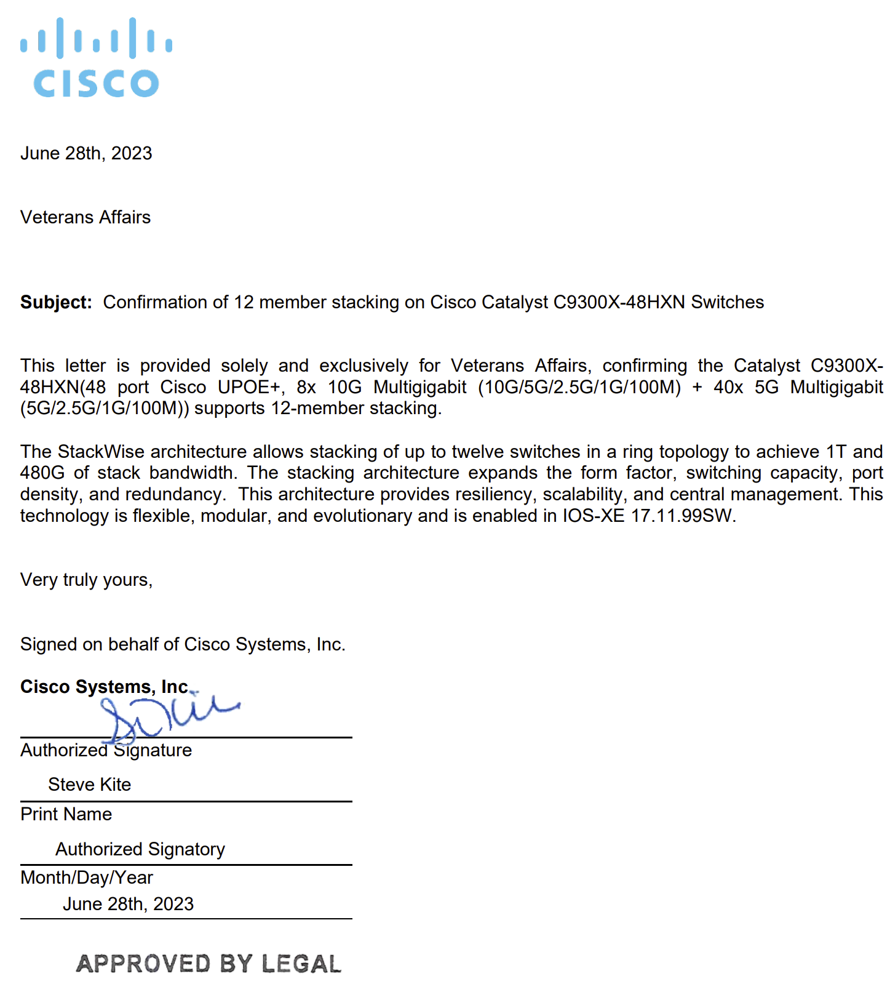

# Cisco Catalyst C9300X-48HXN Supports 12 Member Stacking

Based in no small part on our customers need to support unique missions, Cisco proudly introduces a recent innovation on our Catalyst C9300X-48HXN platform, designed to elevate large-scale enterprise connectivity. Tailored to meet mission-critical needs, Cisco is confirming the Catalyst C9300X-48HXN(48 port Cisco UPOE+, 8x 10G Multigigabit (10G/5G/2.5G/1G/100M) + 40x 5G Multigigabit (5G/2.5G/1G/100M)) supports 12-member stacking.
 
The StackWise architecture allows stacking of up to twelve switches in a ring topology to achieve 1T and 480G of stack bandwidth. The stacking architecture expands the form factor, switching capacity, port density, and redundancy. This architecture provides resiliency, scalability, and central management. This technology is flexible, modular, and evolutionary and is enabled in IOS-XE 17.11.99SW. Cisco: Transforming connectivity for enterprises demanding the best.

